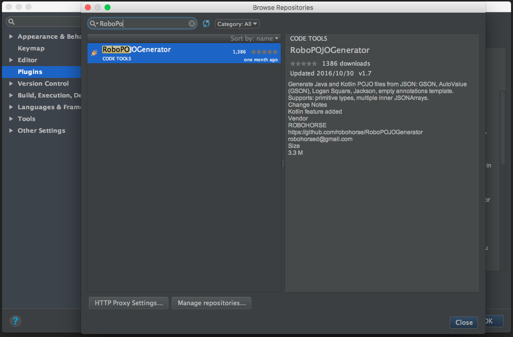
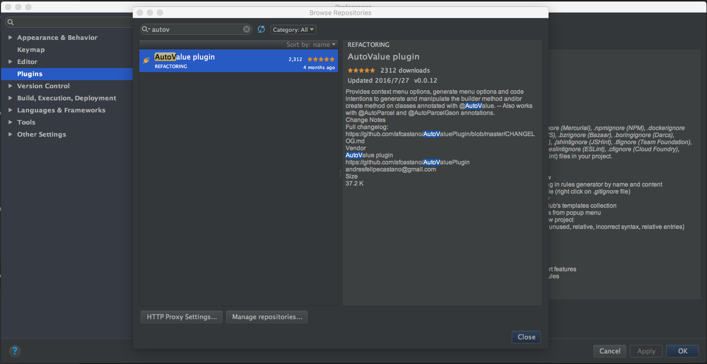
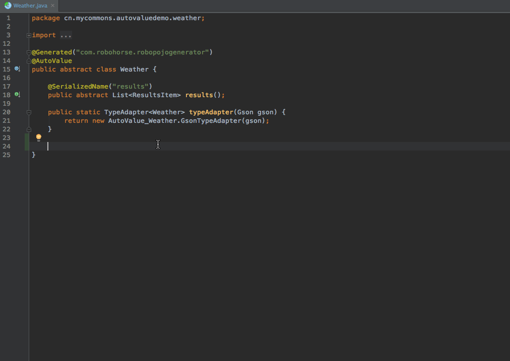
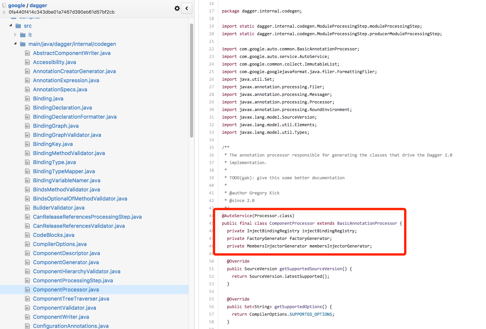
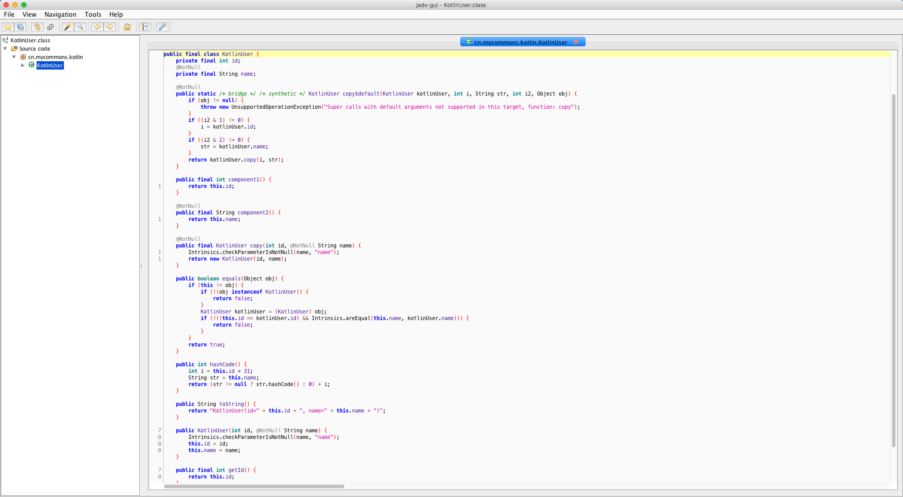

# Android Model正确使用姿势——AutoValue

---

[TOC]

最近看到几篇博客是关于AutoValue的，然后自己十分喜欢，一下子觉的这样写代码很**优雅**，所以决定自己也写一篇文章介绍下AutoValue。

**本文最先发表于[Github](https://github.com/LiushuiXiaoxia/AutoValueDemo)，如有转载，请注明转载出处。**

# 前言

首先说Android Model，在开发中网络请求，以及数据库操作等，我们都会定义一个Model，不同人对这个的说法不一样，比如有Entry，Bean，Pojo。

然后开发的过程中会遇到下面问题：

* 构成方法：自定义构造方法，如果实体比较复杂，可能会用到工厂模式或者是建造者模式

* 序列化：比如实现Serializable接口，Parcelable接口。

* Json解析：有时候直接使用的是json数据，比如@SerializedName注解。

* 自定义方法：对Model的字段有setter，getter方法，toString的实现，在处理hash的时候，需要实现equals和hashcode方法。

以上这么问题，其实在Eclipse和Android Studio中都是有快捷功能帮我们自动生成，后面的代码示例，就是我用Android Studio自动生成的。

比如下面一个User类是我们的本次示例的一个Model，如果按照正常的写法，是这样的。

```java
public abstract class User implements Serializable {

    @SerializedName("id")
    private int id;

    @SerializedName("name")
    private String name;

    public int getId() {
        return id;
    }

    public void setId(int id) {
        this.id = id;
    }

    public String getName() {
        return name;
    }

    public void setName(String name) {
        this.name = name;
    }

    @Override
    public boolean equals(Object o) {
        if (this == o) return true;
        if (o == null || getClass() != o.getClass()) return false;

        User user = (User) o;

        if (id != user.id) return false;
        return name != null ? name.equals(user.name) : user.name == null;

    }

    @Override
    public int hashCode() {
        int result = id;
        result = 31 * result + (name != null ? name.hashCode() : 0);
        return result;
    }

    @Override
    public String toString() {
        return "User{" +
                "id=" + id +
                ", name='" + name + '\'' +
                '}';
    }
}
```

# 简介

官方文档给出的解释是这样的，大致意思是说是一个生成Java不可变的值类型工具，仔细研读源代码后，使用的技术是Java Apt，这个后面再做详细解释。

> AutoValue - Immutable value-type code generation for Java 1.6+.


# 简单使用

按照上面的例子，如果是AutoValue，代码是这样的。

首先需要在Android项目里面引入apt功能，在项目根目录的gradle中添加，

```
buildscript {
    repositories {
        jcenter()
    }
    dependencies {
        classpath 'com.android.tools.build:gradle:2.2.2'
        // 引入apt插件
        classpath 'com.neenbedankt.gradle.plugins:android-apt:1.8'
    }
}
```

其次在module(一般是app目录)中gradle使用apt插件。

```
apply plugin: 'com.android.application'
apply plugin: 'com.neenbedankt.android-apt'
```

最后加入AutoValue依赖。

```
dependencies {
    provided 'com.google.auto.value:auto-value:1.3'
    apt 'com.google.auto.value:auto-value:1.3'
}
```

修改User类，如下所示，User已经变成了一个抽象类，类似于使用Retrofit一样，申明已经变成了一个接口，然后实现类是由AutoValue生成的代码。

```java
import com.google.auto.value.AutoValue;

@AutoValue
public abstract class User {

    public abstract int id();

    public abstract String name();

    public static User newInstance(int id, String name) {
        return new AutoValue_User(id, name);
    }
}
```

我们可以看看AutoValue到底干了什么？

AutoValue会自动生成一个AutoValue_User，这个类是继承了上面申明的User类，这个是默认default的访问权限，那么在其他package中是无法访问的，这样在其他代码里面也不会看到这么奇怪的名字。

同时所有的字段都是final类型，如果字段是对象类型的，那么还不能为空，这个问题先保留，后面再做详解。因为申明的是final类型，那么所有的字段都是没有setter方法的。

代码里同时也实现了equals、hashcode、toString方法。

```java
 final class AutoValue_User extends User {

  private final int id;
  private final String name;

  AutoValue_User(
      int id,
      String name) {
    this.id = id;
    if (name == null) {
      throw new NullPointerException("Null name");
    }
    this.name = name;
  }

  @Override
  public int id() {
    return id;
  }

  @Override
  public String name() {
    return name;
  }

  @Override
  public String toString() {
    return "User{"
        + "id=" + id + ", "
        + "name=" + name
        + "}";
  }

  @Override
  public boolean equals(Object o) {
    if (o == this) {
      return true;
    }
    if (o instanceof User) {
      User that = (User) o;
      return (this.id == that.id())
           && (this.name.equals(that.name()));
    }
    return false;
  }

  @Override
  public int hashCode() {
    int h = 1;
    h *= 1000003;
    h ^= this.id;
    h *= 1000003;
    h ^= this.name.hashCode();
    return h;
  }
}
```

# Immutable/Value types

刚刚上面说到，所有的字段都是final类型，那么而且实现类也是final的，有个专业术语叫Immutable。

Immutable/Value types 这个概念对有些朋友来说可能还比较陌生，简单来说就是一个数据对象一旦构造完成，就再也无法修改了。

这样有什么好处呢？最大的好处就是多线程访问可以省去很多同步控制，因为它们是不可变的，一旦构造完成，就不会存在多线程竞争访问问题了。多线程最麻烦的处理就是控制好读写问题，如果大家都是读，那么就不存控制了，所以省去了很多同步操作。

更多关于Immutable 的介绍，可以参阅 [wiki](https://en.wikipedia.org/wiki/Immutable_object) 。

举个Java中的例子：String和StringBuilder，String是immutable的，每次对于String对象的修改都将产生一个新的String对象，而原来的对象保持不变，而StringBuilder是mutable，因为每次对于它的对象的修改都作用于该对象本身，并没有产生新的对象。

Immutable objects 比传统的mutable对象在多线程应用中更具有优势，它不仅能够保证对象的状态不被改变，而且还可以不使用锁机制就能被其他线程共享。

总结下Immutable对象的优缺点：

**优点**

* Immutable对象是线程安全的，可以不用被synchronize就在并发环境中共享
* Immutable对象简化了程序开发，因为它无需使用额外的锁机制就可以在线程间共享
* Immutable对象提高了程序的性能，因为它减少了synchroinzed的使用
* Immutable对象是可以被重复使用的，你可以将它们缓存起来重复使用，就像字符串字面量和整型数字一样。你可以使用静态工厂方法来提供类似于valueOf（）这样的方法，它可以从缓存中返回一个已经存在的Immutable对象，而不是重新创建一个。

**缺点**

Immutable也有一个缺点就是会制造大量垃圾，由于他们不能被重用而且对于它们的使用就是”用“然后”扔“，字符串就是一个典型的例子，它会创造很多的垃圾，给垃圾收集带来很大的麻烦。当然这只是个极端的例子，合理的使用immutable对象会创造很大的价值。

# 高级使用

## Nullable

上面说过如果类中有对象类型的成员变量，那么是为非空的，但是在实际情况下，有的字段的是值就是为null，所以在申明时候可申明为Nullable就可以了。

```java
import android.support.annotation.Nullable;

import com.google.auto.value.AutoValue;
import com.google.gson.annotations.SerializedName;

@AutoValue
public abstract class NullableUser {

    @SerializedName("id")
    public abstract int id();

    @Nullable
    @SerializedName("name")
    public abstract String name();

    public static NullableUser newInstance(int id, String name) {
        return new AutoValue_NullableUser(id, name);
    }
}
```
生成代码：

```java
final class AutoValue_NullableUser extends NullableUser {

  private final int id;
  private final String name;

  AutoValue_NullableUser(
      int id,
      @Nullable String name) {
    this.id = id;
    this.name = name;
  }
}
```

测试用例

```java
    @Test(expected = NullPointerException.class)
    public void testUserNullPointException() throws Exception {
        User.newInstance(100, null);
    }

    @Test
    public void testUserNullable() {
        NullableUser user = NullableUser.newInstance(100, "test");

        System.out.println("user = " + user);
        Assert.assertEquals(user.id(), 100);
        Assert.assertEquals(user.name(), "test");
    }
```

## Gson序列化

Gson 使用比较麻烦，在普通的Model中，只需要在字段上面添加 @SerializedName注解即可。但是使用AutoValue，稍微有点繁琐。

首先需要引入一个依赖包，这里是[Auto value gson Github](https://github.com/rharter/auto-value-gson)。

```sh
    provided 'com.ryanharter.auto.value:auto-value-gson:0.4.4'
    apt 'com.ryanharter.auto.value:auto-value-gson:0.4.4'
```

其次申明的抽象类中，每个方法上面添加对应的注解，然后再添加一个`typeAdapter`方法，申明这个方法，Gson就会根据这个找到对应的adapter，如下所示。

```java
@AutoValue
public abstract class User {

    @SerializedName("id")
    public abstract int id();

    @SerializedName("name")
    public abstract String name();

    public static User newInstance(int id, String name) {
        return new AutoValue_User(id, name);
    }

    public static TypeAdapter<User> typeAdapter(Gson gson) {
        return new AutoValue_User.GsonTypeAdapter(gson);
    }
}
```

`typeAdapter`方法模板如下，T就是你当前Model的名字，写完以后会出现错误，没事重新编译下就好了，这样就会重新生成了代码。

```java
public static TypeAdapter<T> typeAdapter(Gson gson) {
   return new AutoValue_T.GsonTypeAdapter(gson);
}
```

第三申明一个TypeAdapterFactory的一个实现类，这个类是abstract的，AutoValue也会自动生成其实现类。

```java
@GsonTypeAdapterFactory
public abstract class MyAdapterFactory implements TypeAdapterFactory {

    public static TypeAdapterFactory create() {
        return new AutoValueGson_MyAdapterFactory();
    }
}
```

最后是单元测试，在json字符串转Model的时候，会使用一个Gson对象，这个对象不是平常使用的对象，需要自定义配置一些东西，然后这里就用到了上面所申明的`MyAdapterFactory`。

```java
    @Test
    public void testUserToJson() {
        User user = User.newInstance(100, "test");

        String json = new Gson().toJson(user);
        System.out.println(json);

        Assert.assertEquals("{\"id\":100,\"name\":\"test\"}", json);
    }

    @Test
    public void testUserParseFromJson() {
        String json = "{\"id\":100,\"name\":\"test\"}";
        
        // 自定义的Gson对象，需要配置 MyAdapterFactory
        Gson gson = new GsonBuilder().registerTypeAdapterFactory(MyAdapterFactory.create()).create();

        User user = gson.fromJson(json, User.class);
        System.out.println(user);
        Assert.assertNotNull(user);
        Assert.assertEquals(user.name(), "test");
        Assert.assertEquals(user.id(), 100);

        NullableUser nullableUser = gson.fromJson(json, NullableUser.class);
        System.out.println(nullableUser);
        Assert.assertNotNull(nullableUser);
        Assert.assertEquals(nullableUser.name(), "test");
        Assert.assertEquals(nullableUser.id(), 100);
    }
```

## Serializable & Parcelable

Serializable是Java自带的序列化方式，和AutoValue结合不影响原先使用，只需要在申明的Model中实现Serializable接口即可。

Parcelable是Android提供的序列化方式，如果需要和AutoValue结合使用，和Serializable基本差不多，实现相关接口，然后在Gradle文件引入相关apt依赖即可。

```sh
    apt 'com.ryanharter.auto.value:auto-value-parcel:0.2.5'
    // Optionally for TypeAdapter support
    // compile 'com.ryanharter.auto.value:auto-value-parcel-adapter:0.2.5'
```

[auto-value-parcel Github地址](https://github.com/rharter/auto-value-parcel)

上面的`auto-value-parcel-adapter`是可选项，是auto-value-parcel提供自定义类型转化，相关使用可以参见Github地址。

检查下Autovalue自动给我们实现的代码，果然不出所料，全部自动生成了。

```java
final class AutoValue_User extends $AutoValue_User {
  public static final Parcelable.Creator<AutoValue_User> CREATOR = new Parcelable.Creator<AutoValue_User>() {
    @Override
    public AutoValue_User createFromParcel(Parcel in) {
      return new AutoValue_User(
          in.readInt(),
          in.readString()
      );
    }
    @Override
    public AutoValue_User[] newArray(int size) {
      return new AutoValue_User[size];
    }
  };

  AutoValue_User(int id, String name) {
    super(id, name);
  }

  @Override
  public void writeToParcel(Parcel dest, int flags) {
    dest.writeInt(id());
    dest.writeString(name());
  }

  @Override
  public int describeContents() {
    return 0;
  }
}
```

## Retrofit和Rxjava结合使用

Android 开发的时候，很多开发者使用Retrofit这个网络库，以及RxJava异步工具。下面举例如何结合使用AutoValue，Retrofit，Rxjava。

这里有个获取天气的接口，返回的结果是json，我们用这个来测试下Retrofit。

```
// https://api.thinkpage.cn/v3/weather/now.json?key=x4qjfuniyu97mt9y&location=beijing&language=zh-Hans&unit=c
{
  "results": [
    {
      "location": {
        "id": "WX4FBXXFKE4F",
        "name": "北京",
        "country": "CN",
        "path": "北京,北京,中国",
        "timezone": "Asia/Shanghai",
        "timezone_offset": "+08:00"
      },
      "now": {
        "text": "霾",
        "code": "31",
        "temperature": "10"
      },
      "last_update": "2016-12-02T14:45:00+08:00"
    }
  ]
}
```

申明Retrofit Api接口，一个普通的调用，一个是RxJava的方式。

```java
public interface IWeatherApi {

    @GET("/v3/weather/now.json?key=x4qjfuniyu97mt9y&location=beijing&language=zh-Hans&unit=c")
    Call<Weather> getWeather();

    @GET("/v3/weather/now.json?key=x4qjfuniyu97mt9y&location=beijing&language=zh-Hans&unit=c")
    Observable<Weather> getWeatherWithRx();
}
```

Retrofit 接口创建

```java
public class RetrofitUtil {
    public static <T> T createApi(@NonNull Class<T> tClass, Gson gson) {
        return new Retrofit.Builder()
                .baseUrl("https://api.thinkpage.cn")
                .client(new OkHttpClient.Builder().build())
                .addConverterFactory(GsonConverterFactory.create(gson))
                .addCallAdapterFactory(RxJavaCallAdapterFactory.create())
                .build()
                .create(tClass);
    }
}
```

Weather Model申明
```java
public abstract class Weather {

    @SerializedName("results")
    public abstract List<ResultsItem> results();

    public static TypeAdapter<Weather> typeAdapter(Gson gson) {
        return new AutoValue_Weather.GsonTypeAdapter(gson);
    }
}
```

测试用例，注意：Retrofit使用Gson和前面使用Gson使用方式一样，需要自己自定义，不然无法解决json解析问题。

```java
    @Test
    public void testRetrofitWithAutoValue() {
        Gson gson = new GsonBuilder().registerTypeAdapterFactory(MyAdapterFactory.create()).create();
        IWeatherApi weatherApi = RetrofitUtil.createApi(IWeatherApi.class, gson);
        try {
            // 同步调用
            Weather weather = weatherApi.getWeather().execute().body();
            Assert.assertNotNull(weather);

            System.out.println(weather);

            // Rxjava 使用
            weatherApi.getWeatherWithRx().subscribe(new Action1<Weather>() {
                @Override
                public void call(Weather weather) {
                    System.out.println(weather);
                }
            });
        } catch (IOException e) {
            e.printStackTrace();
        }
    }
```

运行结果，正常的返回天气信息。

```
Weather{results=[ResultsItem{now=Now{code=31, temperature=9, text=霾}, lastUpdate=2016-12-02T14:15:00+08:00, location=Location{country=CN, path=北京,北京,中国, timezone=Asia/Shanghai, timezoneOffset=+08:00, name=北京, id=WX4FBXXFKE4F}}]}
Weather{results=[ResultsItem{now=Now{code=31, temperature=9, text=霾}, lastUpdate=2016-12-02T14:15:00+08:00, location=Location{country=CN, path=北京,北京,中国, timezone=Asia/Shanghai, timezoneOffset=+08:00, name=北京, id=WX4FBXXFKE4F}}]}
```

# 相关插件

## RoboPOJOGenerator

GsonFormat是一款Android Studio的插件，它可以把json字符串，转变成Model对象，很多人都喜欢用它。

但是如果使用了AutoValue，那么原先的插件就不能使用了，没有关系，本来打算自己高仿GsonFormat重新写了一个插件，以实现我们的需求，后面又发现有一款插件可以实现——RoboPOJOGenerator。



RoboPOJOGenerator使用， [RoboPOJOGenerator Github地址](https://github.com/robohorse/RoboPOJOGenerator)


## AutoValue plugin

上面我们发现有了json字符串，有时候还要写factory和buildder方法，那么问题来了，没有插件能帮我们实现这个步骤，然代码更加的优雅，开发更加高效？

答案是肯定的，Autovalue plugin就是干这个事的。



[Auto value plugin Github](https://github.com/afcastano/AutoValuePlugin)

我们用刚刚上面的Weather做演示，相关演示：



# 原理介绍

本文重点介绍的AutoValue只是 [Google Auto](https://github.com/google/auto) 中的一小部分，Auto中还有其他好玩的。

## AutoFactory 

AutoFactory和AutoValue类似，可以自动帮助代码生成工厂类，兼容Java 依赖注入标准（JSR-330）。

代码示例

```java
@AutoFactory
public class FactoryUser {

    private final int id;

    private final String name;

    public FactoryUser(int id, String name) {
        this.id = id;
        this.name = name;
    }

    public int getId() {
        return id;
    }

    public String getName() {
        return name;
    }

    @Override
    public String toString() {
        return "FactoryUser{" +
                "id=" + id +
                ", name='" + name + '\'' +
                '}';
    }
}
```

生成后的代码

```java
public final class FactoryUserFactory {
  @Inject
  public FactoryUserFactory() {
  }
  public FactoryUser create(int id, String name) {
    return new FactoryUser(id, name);
  }
}
```

测试代码

```java
    @Test
    public void testFactoryUser() {
        FactoryUser user = new FactoryUserFactory().create(100, "test");

        System.out.println(user);
        Assert.assertNotNull(user);
        Assert.assertEquals(100, user.getId());
        Assert.assertEquals("test", user.getName());
    }
```

## AutoService

AutoService比较简单，就是在使用Java APT的时候，使用AutoService注解，可以自动生成meta信息。

## AutoCommon

这个是Google对Java Apt的一个扩展，一般的在自己写Apt的时候，都需要继承`AbstractProcessor`，但是google对它进行了扩展，`BasicAnnotationProcessor`，如果你想自己写个工具，那么就可以使用这个了。

给大家举个栗子，Dagger当初是Square公司受到Guice的启发，然后自己开发出一套依赖注入框架，当时Dagger使用的是Java反射，大家知道Java反射的效率其实并不高。

再后来都到了AutoValue的启发，在Dagger的分支上切个新分支，开发出Dagger2，然后这个Dagger2是由Google维护的，我们可以在Dagger2的Github上面找到证据。



## 
# Auto相关使用

## IntentBuilder

有时候几个Activity之间相互跳转的时候需要传递一些参数，这些参数可以是基本类型，也有可能是复杂的类型，如果是负责的类型，必须要实现Serializable 或 Parcelable接口，上面也有介绍。

下面推IntentBuilder，IntentBuilder也是利用代码生成的方法实现的。

[IntentBuilder Github](https://github.com/emilsjolander/IntentBuilder)

Activity传参

```java
@IntentBuilder
class DetailActivity extends Activity {

    @Extra
    String id;

    @Extra @Nullable
    String title;

    @Override
    public void onCreate(Bundle savedInstanceState) {
        super.onCreate(savedInstanceState);
        DetailActivityIntentBuilder.inject(getIntent(), this);
        // TODO use id and title
    }
}

// 调用方式
startActivity(
    new DetailActivityIntentBuilder("12345")
        .title("MyTitle")
        .build(context)
)
```

Service传参

```java
@IntentBuilder
class DownloadService extends IntentService {

    @Extra
    String downloadUrl;

    @Override
    protected void onHandleIntent(Intent intent) {
        MyServiceIntentBuilder.inject(intent, this);
    }

}

startService(new DownloadServiceIntentBuilder("http://google.com").build(context))
```

## FragmentArgs

上面介绍了Activity、Service的传参，但Fragment的传参方式是不一样的，还有需要提醒一句一般通过setter方法给Fragment传参是不是正确的方式，必须通过setArgs的方式。

[fragmentargs Github](https://github.com/sockeqwe/fragmentargs)

相关代码示例：

```java
@FragmentWithArgs
public class MyFragment extends Fragment {
    @Arg
    int id;

    @Override
    public void onCreate(Bundle savedInstanceState) {
        super.onCreate(savedInstanceState);
        FragmentArgs.inject(this); 
        // inject 之后，就可以使用 id 了
    }
}

MyFragment fragment = MyFragmentBuilder.newMyFragment(101);
```

# 其他相关

## Kotlin Data Class

Kotlin 是一个基于 JVM 的新的编程语言，由 JetBrains 开发。有机会可以向大家介绍这种语言。

Kotlin 中提供一种类似于AutoValue中的功能，Data Class表示这个类似是一个数据类型。

比如下面是kotlin中对Model的写法，就是这么的简单、明了、优雅。

```kotlin
data class KotlinUser(val id: Int,
                      val name: String)
```

Kotlin与Java是可以相互调用的。下面是Java的测试用例。

```java
public class UserTest {

    @Test
    public void testUser() {
        KotlinUser user = new KotlinUser(100, "test");

        System.out.println(user);

        Assert.assertEquals(100, user.getId());
        Assert.assertEquals("test", user.getName());
    }
}
```

我们可以反编译Kotlin生成的class字节码，看看这个中间到底发生了什么，很明显Kotlin做了很多的语法糖，这里编译器生成的代码和上面Autovalue生成的代码很像。



## Object-C

Object-C中可以过直接申明@property方式，然后就可以自动实现setter和getter方法，如果要实现Immutable type方式，需要注明readonly。

hash、equals、description如果使用APPCode，代码是可以自动生成的。

```object-c
@interface OcUser : NSObject

@property(readonly) int id;

@property(retain, readonly) NSString *name;

- (instancetype)initWithId:(int)id name:(NSString *)name;

- (NSString *)description;

- (BOOL)isEqual:(id)other;

- (BOOL)isEqualToUser:(OcUser *)user;

- (NSUInteger)hash;

@end

// ==========================

#import "OcUser.h"
@implementation OcUser {

}
- (instancetype)initWithId:(int)id name:(NSString *)name {
    self = [super init];
    if (self) {
        _id   = id;
        _name = name;
    }

    return self;
}

- (BOOL)isEqual:(id)other {
    if (other == self)
        return YES;
    if (!other || ![[other class] isEqual:[self class]])
        return NO;

    return [self isEqualToUser:other];
}

- (BOOL)isEqualToUser:(OcUser *)user {
    if (self == user)
        return YES;
    if (user == nil)
        return NO;
    if (self.id != user.id)
        return NO;
    return !(self.name != user.name && ![self.name isEqualToString:user.name]);
}

- (NSUInteger)hash {
    NSUInteger hash = (NSUInteger) self.id;
    hash = hash * 31u + [self.name hash];
    return hash;
}

- (NSString *)description {
    NSMutableString *description = [NSMutableString stringWithFormat:@"<%@: ", NSStringFromClass([self class])];
    [description appendFormat:@"self.id=%i", self.id];
    [description appendFormat:@", self.name=%@", self.name];
    [description appendString:@">"];
    return description;
}
@end
```

测试用例

```objc
#import <Foundation/Foundation.h>
#import "OcUser.h"

int main(int argc, const char *argv[]) {
    @autoreleasepool {
        OcUser *user = [[OcUser alloc] initWithId:100 name:@"test"];

        NSLog(@"user = %@", user);
    }

    return 0;
}

// 运行结果
// user = <OcUser: self.id=100, self.name=test>
```

# 总结

本文主要介绍了Autovalue的主要用法，以及AutoValu周边只是，可能说的比较多，比较杂，而且有的地方也不够深入，但是个人觉的这是一种思路，一种解决方案，后面如果自己需要造轮子的时候，我们是可以借鉴的。

本示例代码地址 [AutoValueDemo](https://github.com/LiushuiXiaoxia/AutoValueDemo)

# 参考连接

[AutoValueDemo](https://github.com/LiushuiXiaoxia/AutoValueDemo)

[完美Model之AutoValue使用](http://bigmercu.top/2016/09/08/%E5%AE%8C%E7%BE%8EModel%E4%B9%8BAutoValue%E4%BD%BF%E7%94%A8/)

[完美的安卓 model 层架构（上）](http://blog.piasy.com/2016/05/06/Perfect-Android-Model-Layer/)

[完美的安卓 model 层架构（下）](http://blog.piasy.com/2016/05/12/Perfect-Android-Model-Layer-2/)

[AutoValue Github](https://github.com/google/auto/tree/master/value)

[Java Immutable 介绍](https://my.oschina.net/jasonultimate/blog/166810)

[Auto value gson Github](https://github.com/rharter/auto-value-gson)

[Auto value parcel Github](https://github.com/rharter/auto-value-parcel)

[RoboPOJOGenerator Github](https://github.com/robohorse/RoboPOJOGenerator)

[Auto value plugin Github](https://github.com/afcastano/AutoValuePlugin)

[IntentBuilder Github](https://github.com/emilsjolander/IntentBuilder)

[Fragmentargs Github](https://github.com/sockeqwe/fragmentargs)